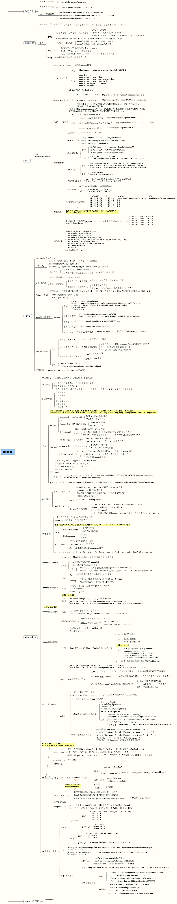

# hadoop-mr-demo
HADOOP MR DEMO 示例。

### 概要:
* com.ares.hadoop.mr.wordcount:      MR--WordCount, 使用Combiner减少Map输出
* com.ares.hadoop.mr.flowsum  ：     MR--自定义序列化, 实现Hadoop的Writable接口
* com.ares.hadoop.mr.flowsort ：     MR--自定义排序, 实现WritableComparable接口compareTo方法
* com.ares.hadoop.mr.flowgroup：     MR--自定义分组, 自定义Partition，实现getPartition方法, REDUCE任务数设置机制
* com.ares.hadoop.mr.inverseindex：  MR--如何使用MR实现倒排索引？

### 截图：       
* MR: 
